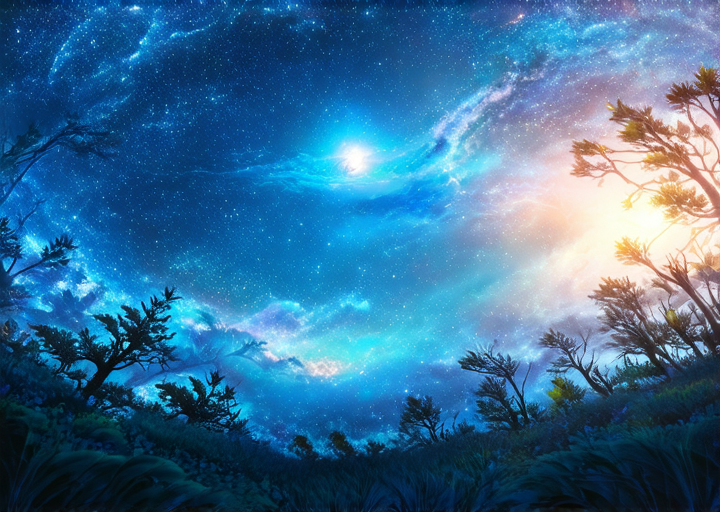
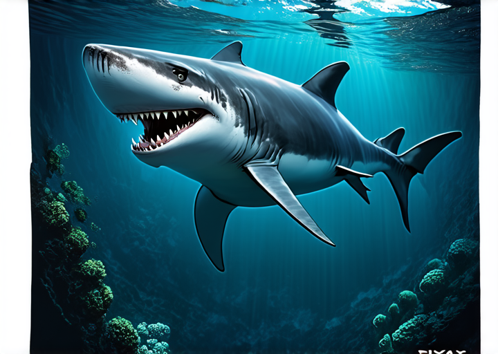
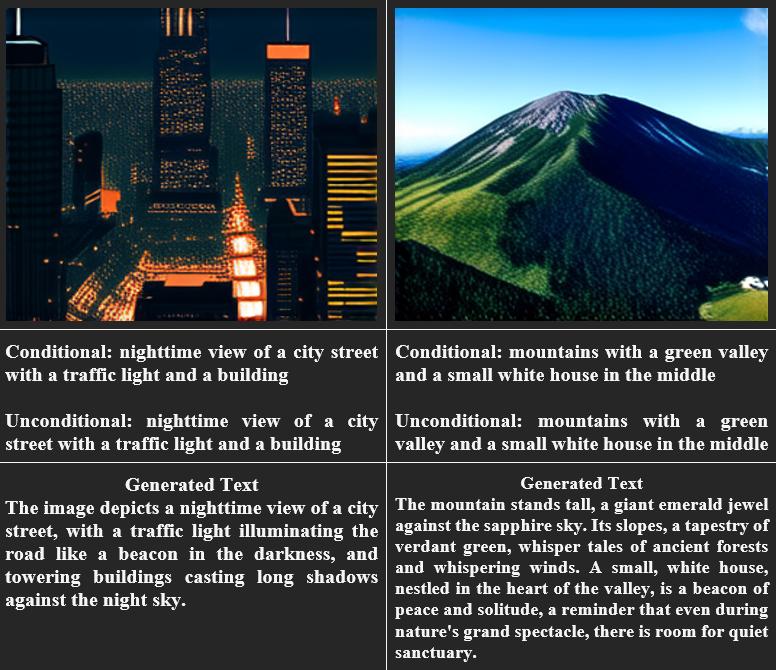
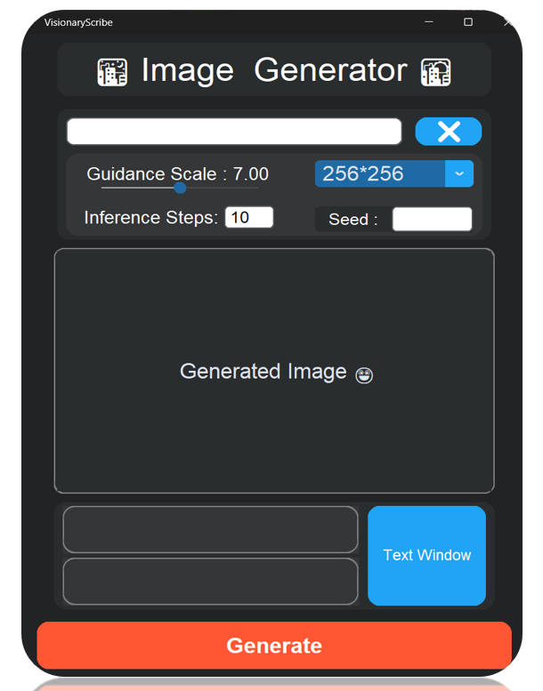
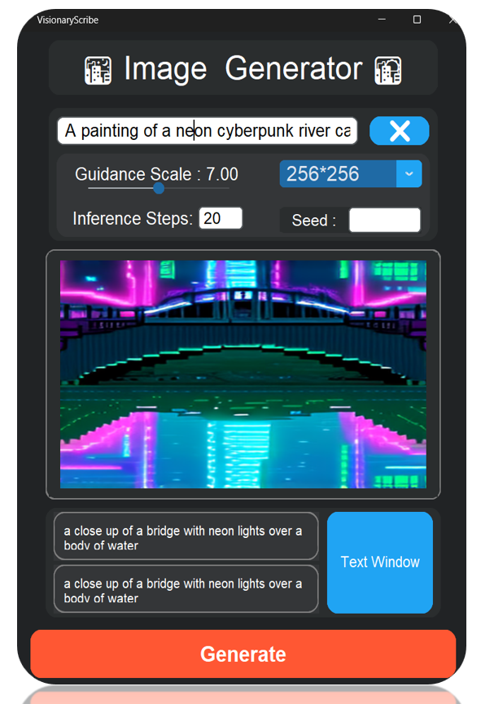
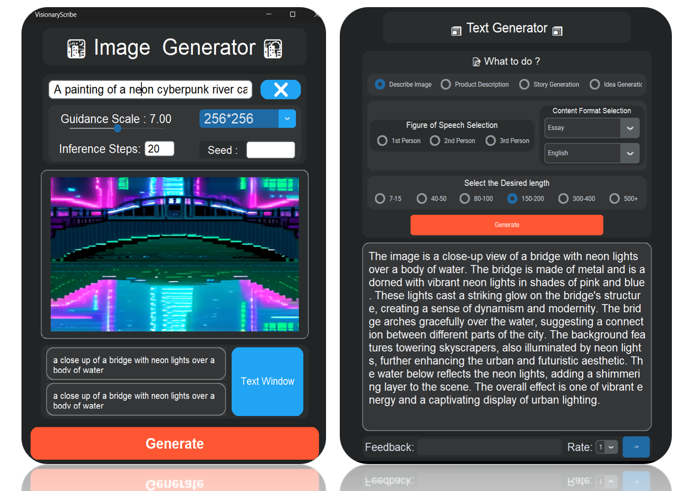

# Visionary Scribe

To run the application, follow these steps:

1. **Install Dependencies**: Create a new environment and ensure you have all the required dependencies installed. You can do this by running the following command in your terminal:

   ``` 
   pip install -r requirements.txt
   ```
2. **Log into Hugging Face**: Before this step get access to [Stable Diffusion 3](https://huggingface.co/stabilityai/stable-diffusion-3-medium) model and generate an `api key/token using` with `write` permission by following the steps on the site for the model. Then do the below steps:
   ```
   pip install -U "huggingface_hub[cli]"

   huggingface-cli login
   ```
3. **Set Environment Variables**: Make sure to set your Gemini API key in the environment variables. You can do this in your terminal or directly in environment variable (windows). To get it click [here](https://deepmind.google/technologies/gemini/flash/) and read the documentation or follow steps simply listed on the site. 

   ```
   set GEMINI_API_KEY=your_gemini_api_key
   ```

    On Windows, you can set environment variables using the `set` command:

    ```
    set HUGGING_FACE_API_KEY=your_hugging_face_api_key
    set GEMINI_API_KEY=your_gemini_api_key
    ```

4. **Run the Application**: Execute the `app.py` file to start the application:
    ```
    python app.py
    ```
5. **Downloads**: On first time the models will get downloaded this can take up to `15 gb` space or more. On windows path of the folder where the models will get downloaded is as follow : 
    ```
    c:\user\username\.cache
    ```
    you can delete files directly to free the space if you dont  need it anymore.
***

`Models used` :

1. Stable Diffusion

2. Sales Force BLIP model

3. Google Gemini Flash 1.5
<br>
<br>

***

`Minimum Requirements` :

1. `RTX 3060` or GPU with `6gb` of V-RAM (Cpu off-loading will happen automatically)

2. Processor above `Intel i5` or `AMD Ryzen 7` or above. (most likely as i didn't look into this part)
<br>
<br>

***

`Findings` :

| Image Size  | Time per frame | ET Estimated Time | No of Inference Steps |
|-------------|----------------|-------------------|-----------------------|
| 256 * 256   | 3 sec          | 2 min 30 sec      | 51                    |
| 256 * 512   |                |                   |                       |
| 256 * 720   |                |                   |                       |
| 256 * 1024  |                |                   |                       |
| 512 * 512   | 3 sec          | 2 min 30 sec      | 50                    |
| 512 * 720   | 12 sec         | 10 min            | 50                    |
| 512 * 1024  | 18 sec         | 15.3 min          | 50                    |
| 720 * 720   |                |                   |                       |
| 720 * 1024  |                |                   |                       |
| 1024 * 1024 | 51 sec         |     40-50 min     | 50                    |

* These scores are evaluated for RTX 3060 Mobile graphic card. If  higher spec hardware is used score may vary.

* This is still begin worked upon and times will be added soon.


<br>
<br>
<br>
<br>

***

**PROMPT GIVEN FOR ASTRAL SKY COMPOSITION**:

Prompt:&nbsp;&nbsp;&nbsp;&nbsp;&nbsp;&nbsp;&nbsp;<i>Astral wallpaper composition with nature </i>




**Generated Text:**

The night sky was a canvas of glittering stars, swirling with the light of a distant `spiral galaxy`. A single, `brilliant star` `burned brightly` in the inky blackness, its light reflecting off the dew-laden leaves of a lone tree.  The tree stood tall and proud, its branches reaching up towards the heavens as if to touch the stars themselves.  It was a scene of breathtaking beauty, a reminder of the vastness and wonder of the universe.  The silence of the night was broken only by the `rustling of leaves` and the distant chirping of crickets. The air was crisp and cool, carrying with it the scent of pine and damp earth. It was a night for dreaming, for contemplating the mysteries of the `cosmos`.


<br>
<br>

**Image Generation only part :**

Prompt :&nbsp;&nbsp;&nbsp;&nbsp; <i>Fearless shark, ruling the ocean depths, with sharp teeth and powerful presence, by Pixar Animation Studios, by Art Spiegelman, dynamic illustration, dramatic underwater background::2 --ar 2:3 --v 6 --style raw --iw .5 </i>




***
`Testing files :`
* To run the test file first bring them into the main folder where `app.py` is present
* Just use code runner to run them. Made to check the system working only.
* Some test files can have errors also. Still working on them. 


`Output :`

***
# **UI/ UX of the APP**


<table>
  <tr>
    <td></td>
    <td></td>
  </tr>
  <tr>
    <td colspan="2"><center>
    </center></td>
  </tr>
</table>